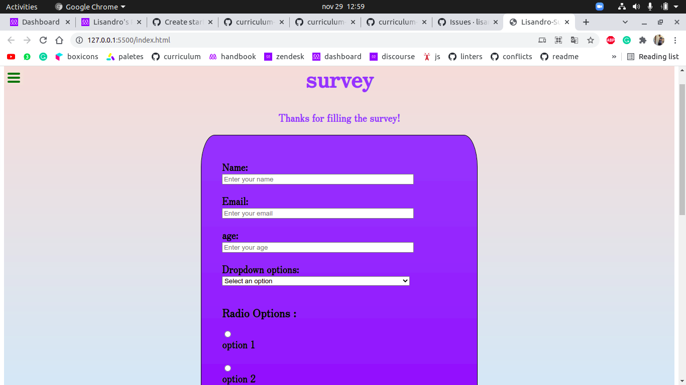

Review trials project

> this is my third microverse project

## Project description:
 
 In this project i made a review of my old code

## Built With

- Major languages
html & css
- 
- Technologies used:
  github

## Live Demo

[Live Demo Link](https://lisandroseia.github.io/Review-Myself/)

## getting started
**Set up**

This project is about commenting my own [pull request](https://github.com/lisandroseia/Review-Myself/pull/1/files), so you have to see my coments in the given link

## Authors

👤 **Author1**

- GitHub: [@lisandroseia](https://github.com/lisandroseia)
- LinkedIn: [LinkedIn](https://www.linkedin.com/in/lisandro-seia-295120225/)

## 🤝 Contributing

Contributions, issues, and feature requests are welcome!

Feel fre to check the [issues](https://github.com/lisandroseia/Review-Myself/issues) page

## Show your support

Give a ⭐️ if you like this project!

## license

this project is [MIT](https://github.com/lisandroseia/REVIEW-MYSELF/blob/main/LICENSE) licensed.